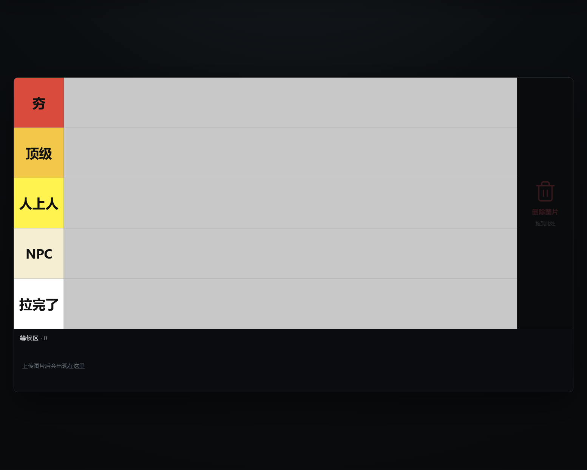
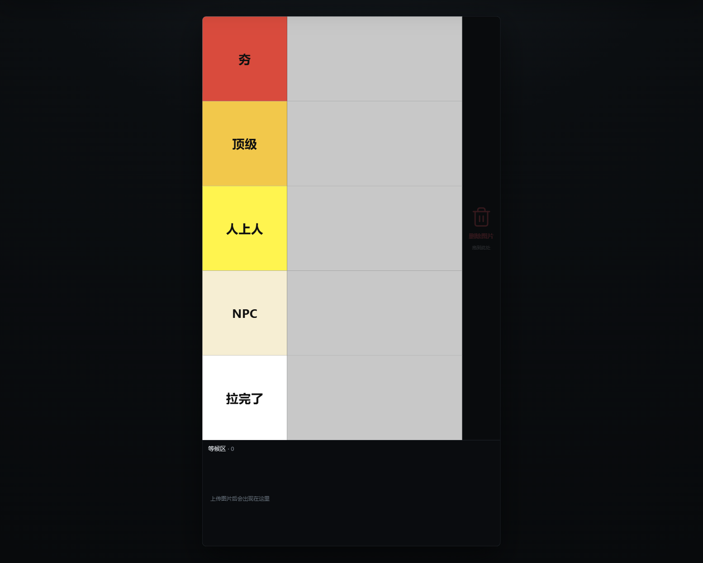
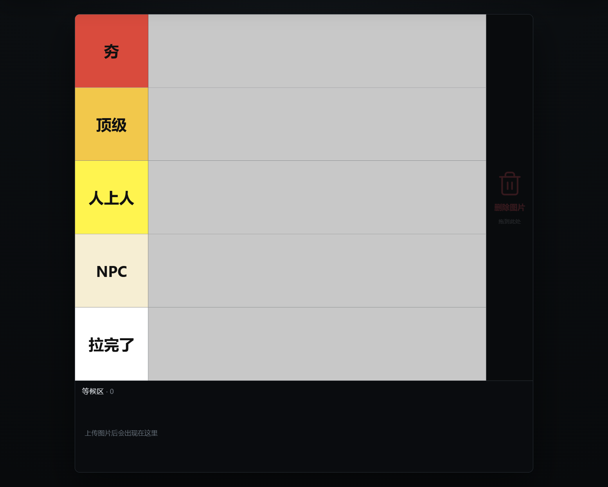

# 从夯到拉排版生成器

一款完全在浏览器本地运行的中文 Tier List 排版、录制与 PNG 导出工具。图片与项目数据只保存在本机 IndexedDB，不会上传至服务器。



## 教学视频

不会用也没关系，跟着视频从上传图片到导出结果完整走一遍：

▶ [观看《从夯到拉排版生成器》教学视频（Bilibili）](https://www.bilibili.com/video/BV1Z2NS6QEWz/?share_source=copy_web&vd_source=bb6dbbeca470fef6fefd9c56dcbedcd0)

## 功能

- 多图上传：支持 PNG、JPG/JPEG、WebP，保留原比例、不裁切。
- 插入式拖拽：图片可在等候区、任意层级间移动并重排；层级本身也可拖拽重排。
- 自由层级：添加、删除、双击改名；删除层级时其中图片会按原顺序移回等候区。
- 自适应画布：16:9、9:16、1:1 固定逻辑画布整体缩放；层级颜色随位置从红色过渡至白色。
- 本地持久化：刷新后自动恢复项目；支持撤销、重做和键盘快捷键。
- 纯画布导出：可导出 1× / 2× / 4× PNG，工具栏、垃圾桶和滚动条不会写入图片。
- 演示模式：隐藏工具栏，便于录制排名过程。
- 图片聚焦预览：双击等候区或排行内的图片即可居中放大；点击任意位置或按 `Esc` 缩回，适合录制时讲解细节。

## 更新日志

### 2026-07-13

- 新增图片聚焦预览：双击图片放大至屏幕中央，点击任意位置、按 `Esc`、`Delete` 或 `Backspace` 即可安全关闭；预览不会写入导出的 PNG。
- 新增本区作为后续功能与改动的维护记录。

<p align="center">
  
  
</p>

## 一键启动（Windows）

直接双击仓库根目录中的 [`启动应用.bat`](启动应用.bat)。它会先检查 Node.js 20+：缺失或版本过低时，会通过 Windows Package Manager（`winget`）安装当前 Node.js LTS；Windows 仍会要求用户确认安装权限。没有 `winget` 时，脚本会自动打开 [Node.js 官方下载页](https://nodejs.org/en/download)。

Node.js 安装完成后，再次双击启动文件即可自动安装项目依赖（首次）并打开本地开发服务器。

也可以在终端运行：

```bash
npm install
npm run dev
```

## 开发与验证

```bash
npm run typecheck
npm run test
npm run test:e2e
npm run build
npm run preview
```

当前验证状态：TypeScript 类型检查通过、12 项单元测试通过、Playwright 主流程通过、生产构建通过，`npm audit` 为 0 个漏洞。

## 快捷键

| 快捷键 | 功能 |
| --- | --- |
| `Ctrl / Cmd + Z` | 撤销 |
| `Ctrl / Cmd + Shift + Z` | 重做 |
| `Delete / Backspace` | 关闭图片预览；否则删除当前选中图片 |
| `Escape` | 关闭图片预览 / 取消编辑 / 退出演示模式 |

## 技术栈

React · TypeScript · Vite · dnd-kit · Zustand · Dexie (IndexedDB) · html-to-image · Vitest · Playwright

## 边界

首版不包含云同步、账号、后端、真实协作或项目 ZIP 导入/导出。浏览器本地存储空间由当前浏览器控制；空间不足时应用会给出提示。
